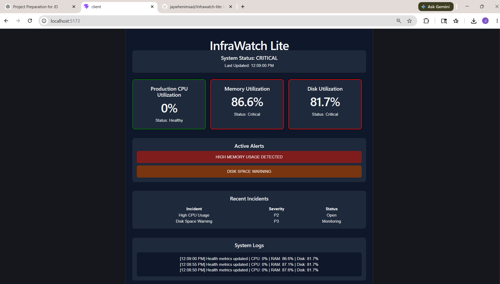
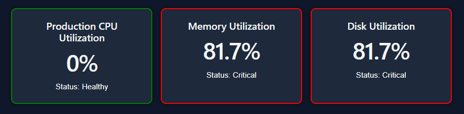
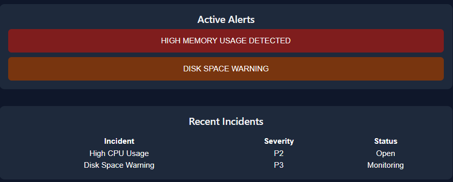

# InfraWatch Lite

InfraWatch Lite is a lightweight Infrastructure Monitoring & Incident Management Dashboard inspired by real-world GCC/NOC operations environments.

The system monitors production health metrics such as CPU, RAM, and Disk utilization using Python scripts and displays them through a real-time React dashboard.

---

# Features

## Infrastructure Monitoring
- Real-time CPU monitoring
- Memory utilization tracking
- Disk usage monitoring
- Auto-refresh health checks

## Alert Management
- High CPU usage alerts
- Memory threshold alerts
- Disk utilization warnings
- Live operational logs

## Incident Management
- Incident tracking dashboard
- Severity levels (P1/P2/P3)
- Incident status monitoring
- Simulated production workflows

## Operational Dashboard
- Live monitoring interface
- System health indicators
- Real-time log updates
- Service monitoring layout

---

# Tech Stack

| Layer | Technology |
|---|---|
| Frontend | React + Vite |
| Backend | Node.js + Express |
| Monitoring Engine | Python |
| System Metrics | psutil |
| API Communication | Axios |
| Runtime | Nodemon |

---

# Architecture

```text
Python Monitoring Script
        ↓
Node.js API Server
        ↓
React Dashboard
        ↓
Real-Time Monitoring UI
```

---

# Project Structure

```text
infrawatch-lite/
│
├── client/          # React frontend
├── server/          # Node.js backend
│   └── scripts/    # Python monitoring scripts
└── README.md
```

---

# Monitoring Metrics

The monitoring engine collects:

- CPU Utilization
- RAM Usage
- Disk Usage
- System Health Status

using Python's `psutil` library.

---

# API Endpoint

## Get System Health

```http
GET /api/health
```

### Sample Response

```json
{
  "cpu": 32,
  "ram": 65,
  "disk": 54
}
```

---

# Installation & Setup

## 1. Clone Repository

```bash
git clone <your-github-repo-url>
```

---

## 2. Backend Setup

```bash
cd server

npm install
```

Install Python dependency:

```bash
pip install psutil
```

Run backend:

```bash
npm run dev
```

---

## 3. Frontend Setup

```bash
cd client

npm install

npm run dev
```

---

# Dashboard Preview

## Features Included

- Real-time metrics monitoring
- Operational alert system
- Incident tracking
- Live system logs
- Status-based monitoring cards

---

# Future Improvements

- Database integration
- Authentication & RBAC
- Docker deployment
- AWS cloud deployment
- Real-time WebSocket monitoring
- SLA analytics
- Email alerting system

---

# Learning Outcomes

This project helped in understanding:

- Infrastructure monitoring concepts
- Incident management workflows
- System health checks
- Production support operations
- Python automation scripting
- Backend API integration
- Real-time dashboard concepts

---

# Author

Jaykumar Rangari

- MCA Graduate
- Cloud & DevOps Enthusiast
- AWS Certified Solutions Architect Associate

   
## Dashboard Screenshot




## Utilization



## Alerts and Incident Screenshot



## System Logs

